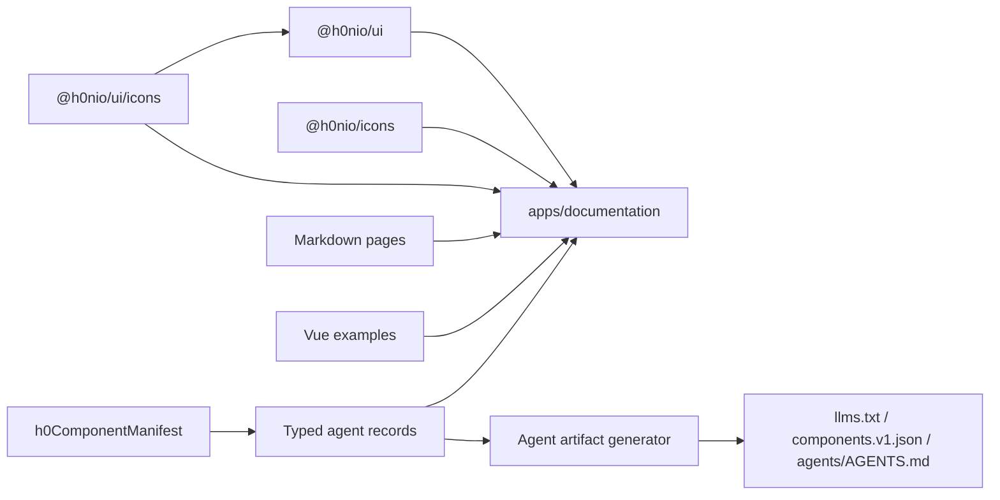

# H0N UI Architecture

Last verified: 2026-08-23

Current library version: `@h0nio/ui` `1.2.0`

H0N UI is a pnpm workspace centered on a self-contained Vue 3 component library, a framework-agnostic icon library, and a source-linked documentation application.

## Maintained Workspace

```text
h0n-ui/
  packages/
    icons/                      # @h0nio/icons: private-in-development icon package
      scripts/                  # Import, generation, validation, and SVG copy tools
      src/                      # Generated definitions, catalog, metadata, and runtime
      svg/                      # Generated package SVG subpaths
    ui/                         # @h0nio/ui: supported Vue component library
      contracts/                # Reviewed public API and CSS-token snapshot
      scripts/                  # Build fixtures, style typings, size verification
      test-consumer/            # Real bundler consumer fixtures
      test-dts/                 # Public TypeScript import fixtures
      tests/                    # Vitest behavior and contract gates
      tests-visual/             # Playwright visual/accessibility gates
      src/
        components/             # Component families and internal _shared helpers
        composables/            # Public Vue composables
        icons/                  # Small system icon set for @h0nio/ui/icons
        styles/                 # Tokens, palettes, theme, mixins, breakpoints
        entry.ts                # Full style-aware package entry
        index.ts                # Root API and Vue plugin
        locale.ts               # App-scoped locale service
        manifest.ts             # Supported component metadata
        theme.ts                # App-scoped appearance service
        types.ts                # Shared public contracts
  apps/
    documentation/              # @h0n/ui-documentation
      public/                   # Static assets and generated agent artifacts
      scripts/                  # Agent artifact generator and tests
      src/
        components/             # Documentation shell and renderers
        content/pages/          # Markdown content and routes
        content/agent/          # Typed records, validation, artifact rendering
        examples/               # Executable Vue examples
        router/                 # Catch-all content router
```

`apps/templates` is incubating and intentionally outside this architecture baseline.

## Runtime and Toolchain

- pnpm workspaces, pinned through `packageManager` to pnpm `11.17.0`
- Vue `3.5`
- TypeScript `5.9` with strict base configuration
- Vite `8`
- Sass/SCSS with CSS custom properties and cascade layers
- Vitest for unit and contract tests
- Playwright and axe-core for visual, interaction, and accessibility checks
- Vue Router and Markdown It in the documentation app
- Documentation scripts require Node `>=22.12.0`

Root scripts explicitly compose `@h0nio/icons`, `@h0nio/ui`, and `@h0n/ui-documentation`. Package filters remain useful for proportional checks.

## Package Relationships



`@h0nio/ui` owns the structural `H0IconDefinition` type, the `H0Icon` renderer, and a deliberately small system set exposed through `@h0nio/ui/icons`. Components use that set for internal controls and must not require `@h0nio/icons`. Public icon props accept compatible structural definitions from any source; components that accept arbitrary visual content expose a named slot where appropriate.

`@h0nio/icons` is the larger framework-agnostic icon catalog. It remains private while its API and collection are being developed. The documentation app aliases the icons package and both UI entries to workspace source and is therefore an integration surface, not a consumer of registry artifacts.

## Library Entry and Plugin

`packages/ui/src/entry.ts` imports `styles/index.scss` and re-exports `src/index.ts`. It is the full bundle entry and the source alias used by documentation.

`packages/ui/src/index.ts`:

1. imports supported public components;
2. explicitly registers them through the default `H0Nui` Vue plugin;
3. creates and provides app-scoped theme, locale, and toast services;
4. exports supported components, composables, runtime helpers, and public types.

Plugin installation creates independent service instances for each Vue app. Theme and toast services dispose listeners and timers through `app.onUnmount`. Locale input can be either configuration for a new service or an existing service instance.

## Supported Components and Draft Placeholders

A supported root component has a synchronized family barrel, root API/registry entry, `h0ComponentManifest` entry, documentation page, and typed agent record. The manifest currently represents the documentation and agent contract; it is not generated by scanning directories.

Orphaned compound members are not retained as public API. In particular, the former `Menu` members were removed because their only context provider was an unexported, unused surface; no application, documentation example, test, or other UI component consumed the family. Reintroducing a menu requires a complete root component, interaction model, documentation, and tests rather than restoring the detached members.

The workspace contains empty placeholder directories under `packages/ui/src/components` and draft example directories under documentation for names not yet supported by the library. They have no current Vue/type/barrel implementation in `packages/ui`, and they are absent from the root API, plugin registry, manifest, pages, and typed records. At the time of this audit these names include:

- `ActionBar`, `Calendar`, `Combobox`, `CursorPagination`, `DatePicker`
- `Disclosure`, `KeyValueList`, `PageHeader`, `Popover`, `Progress`
- `Section`, `Slider`, `Stat`, `Timeline`, `Tree`, `TreeSelect`

`InputGroup` is also an empty placeholder outside the supported root API.

There is an important packaging caveat: `vite.config.ts` automatically creates ES entries for every component directory that contains `index.ts`. The current placeholders have no `index.ts` and do not produce build output, but adding a barrel would make a draft family addressable as `@h0nio/ui/components/<Family>` before the other supported surfaces are synchronized. Treat root API + manifest + documentation + records as the support boundary until entry generation is intentionally restricted or incubation is formalized.

## Component and Type Conventions

Typical family:

```text
packages/ui/src/components/Button/
  H0Button.vue
  Button.types.ts
  index.ts
```

- Vue components use `<script setup lang="ts">` and `defineOptions({ name: 'H0...' })`.
- A family may expose several components, as with `Alert`, `Layout`, `SideNav`, `Tabs`, `Toast`, `Toolbar`, and `Typography`.
- Public component contracts live in `*.types.ts`; internal implementation types remain private.
- Shared public types use the `H0<Concept>` form only when semantics are identical across consumers.
- Reusable implementation behavior belongs in the family, `composables`, or `components/_shared` according to whether it is public and cross-family.
- `_shared` is private and may change without a public deprecation.

Controlled components use `modelValue !== undefined` as the controlled boundary and `defaultValue` for uncontrolled initialization. `update:*` events synchronize models; user interaction events expose normalized public values. Direct user-facing text props take precedence over locale fallbacks.

## Theme, Locale, and Toast Services

`theme.ts` owns reactive app-scoped appearance state:

- theme preference: `light`, `dark`, or `system`;
- resolved theme: `light` or `dark`;
- animation: `low` or `high`;
- density: `compact`, `default`, or `comfortable`;
- radius size: `sm`, `md`, or `lg`;
- typography size: `sm`, `md`, or `lg`;
- optional theme persistence and a custom target element.

The service writes:

- `data-h0n-theme`
- `data-h0n-animation`
- `data-h0n-density`
- `data-h0n-radius-size`
- `data-h0n-typography-size`

Browser globals are guarded for SSR. System-theme listeners are attached only when supported and are removed by `dispose()`.

`useH0ReducedMotion()` combines the reactive app-scoped animation level with `prefers-reduced-motion`. The system preference always wins. Optional continuous effects such as ripples, spinner rotation, skeleton shimmer, and alert loading rotation run only at the `high` animation level; their static semantic or visual fallback remains available in `low` mode.

`locale.ts` provides reactive built-in English strings plus partial application overrides. Components obtain their relevant branch through shared locale helpers. Runtime-value messages are functions.

Toast state is created per plugin installation. It is not a process-global singleton.

## Styling Contract

The global style system is token-driven:

- `styles/index.scss`: layer order, shared scales, appearance attributes, and global compatibility variables;
- `styles/_palettes.scss`: light/dark raw palettes and semantic values;
- `styles/_theme.scss`: theme application and compatibility aliases;
- `styles/_breakpoints.scss`: shared breakpoint values;
- `styles/_mixins.scss`: reusable SCSS implementation helpers;
- component-local scoped styles: family behavior and private aliases.

Stable application-overridable custom-property families use the `--h0n-ui-*` prefix:

- color and semantic surface tokens;
- spacing and radius scales;
- duration and easing;
- font and typography;
- shared control, overlay, scrollbar, table, and layer geometry.

Component-local variables without that prefix are private. The reviewed stable-token set is frozen in `packages/ui/contracts/public-contract.snapshot.json`.

## Packaging

`packages/ui/vite.config.ts` performs two builds:

- UMD build from `src/entry.ts`;
- multi-entry ES build for the full entry, `locale`, `theme`, `manifest`, composables, and discovered component families.

External runtime dependencies are Vue and Floating UI for ES consumers. Type declarations are emitted separately by `vue-tsc`.

The build has two nonstandard but required CSS behaviors:

1. `injectCssIntoEsBundle()` prepends the full CSS import to the ES root bundle.
2. `emitComponentStyleEntries()` emits dependency-complete component CSS entries using ordered `h0n.tokens`, `h0n.base`, and `h0n.components` layers.

Package exports support:

- `@h0nio/ui`
- `@h0nio/ui/style.css`
- `@h0nio/ui/components/<Family>`
- `@h0nio/ui/components/<Family>/style.css`
- `@h0nio/ui/icons`
- root and individual composables
- `locale`, `theme`, and `manifest`

`packages/ui/package.json` is the npm publication manifest. It identifies the public MIT-licensed package, limits published files to `dist`, `README.md`, and `LICENSE`, marks CSS as side-effectful, and keeps repository, issue, style, type, ESM, UMD, and subpath metadata explicit. The package remains public and must not acquire a `private` flag.

`scripts/write-style-types.mjs` creates CSS declaration stubs. Consumer fixtures verify real imports and tree-shaking; size checks enforce bundle budgets. `scripts/verify-package-contents.mjs` performs a dry-run pack and rejects missing export targets, unexpected top-level files, private source/test files, and source maps. `prepublishOnly` runs tests and the complete build before registry publication.

Repository-level contribution, security, and release policies live in `CONTRIBUTING.md`, `SECURITY.md`, and `RELEASING.md`. GitHub issue and pull-request templates route public reports through those policies. Registry publication remains a maintainer action until npm trusted publishing is explicitly configured; the quality workflow does not publish packages.

The `@h0nio/ui/icons` ES entry keeps the small internal system definitions tree-shakeable and independent from the larger `@h0nio/icons` package.

## Documentation Architecture

Documentation pages are Markdown-first. Frontmatter supplies title, description, route path, navigation group/section, and order. `content.ts` discovers pages with `import.meta.glob`, validates them, and renders navigation, search, tables, alerts, examples, and component API directives.

Executable examples live under `src/examples`; Markdown references them by key. The application renders the same Vue source as a live responsive preview and as copyable code.

Component API tables are derived from `ComponentAgentRecordV1` records. Validation enforces:

- one record per supported manifest component;
- exactly one family root per documentation route;
- valid page paths and example keys;
- unique API entries and related components;
- no references to components outside the manifest.

The generator combines records, manifest metadata, pages, examples, and the `@h0nio/ui` package version to produce:

- `public/llms.txt`
- `public/agent-data/components.v1.json`
- `public/agents/AGENTS.md`
- `public/agents/install-prompt.md`

The resources have distinct roles:

- `llms.txt` is the versioned discovery and routing layer. It describes package boundaries, the recommended agent workflow, and every supported component grouped by manifest category.
- `components.v1.json` is the exact machine-readable component contract and guidance layer.
- `agents/AGENTS.md` is a reusable policy template for repositories consuming `@h0nio/ui`.
- `agents/install-prompt.md` is a versioned copy-paste workflow for installing, configuring, and validating H0N UI in an existing Vue project.

Consumer agents resolve leading-slash links against the H0N UI documentation origin, not the consuming application. They treat the installed package version and TypeScript declarations as the executable contract, then use the matching catalog, compact index, and human documentation in that order. These files are derived artifacts and deterministic tests reject stale committed output. MCP server and distributable Agent Skills remain planned and are not part of the current runtime.

## Verification Layers

The core library uses complementary gates:

- `typecheck`: source declarations and consumer-facing DTS imports;
- Vitest behavior tests for components, forms, overlays, SSR isolation, and interactions;
- public API and manifest synchronization tests;
- source-level accessibility and token rules;
- reviewed hashes for root exports, component contracts, and stable CSS variables;
- consumer bundler fixtures for root/subpath JS and CSS;
- bundle-size budgets;
- Playwright visual geometry, screenshots, navigation, forced-colors, and axe checks.

`packages/ui/tsconfig.check.json` checks UI source without requiring another workspace build. `packages/ui/tsconfig.json` remains the declaration-build configuration rooted at UI source.

`tests`, `test-dts`, `test-consumer`, and `tests-visual` are maintained test sources with distinct responsibilities. `test-consumer/dist` and `test-results` are ignored, generated outputs and must not be committed or treated as source directories. Axe runs against executable component previews; color contrast requires a dedicated theme/state matrix and is intentionally outside the structural axe gate.

Documentation verifies TypeScript, generated agent artifacts, generator determinism/schema behavior, and a production Vite build.

At the 2026-07-28 test audit, the reviewed component-contract snapshot was restricted to supported manifest families and excludes private `_shared` implementation files. Files are ordered by repository-relative POSIX paths so the contract is identical on Windows and Linux. The snapshot also freezes the shared public types in `src/types.ts`. Its accepted 1.0 component hash is `b36d0c8a9eaae1a6dcd3ab18134b8088340ed96072fb1bc6c54af01b928e2315`. The DataTable consumer fixture is `16.00 KiB` gzip against a reviewed `18 KiB` budget; all current bundle and component-style budgets pass.

## Stable 1.0 Policy

The supported contract consists of documented root and subpath exports, props, events, slots, exposed methods, public types, and stable CSS variables.

- Patch releases fix behavior without intentional signature changes.
- Minor releases add compatible API and may deprecate existing API.
- Breaking supported API changes require a major release and an explicit migration guide.
- Accessibility fixes may adjust undocumented markup while preserving documented semantics.
- Internal modules, private custom properties, and undocumented DOM structure are not semver guarantees.

An intentional contract change must update implementation, exports, manifest, documentation, typed records, consumer fixtures, and the reviewed contract snapshot as applicable.

## High-Impact Change Map

- `src/index.ts`: root imports, plugin registration, declarations, contract hash.
- `src/manifest.ts`: documentation routing, agent validation, public manifest tests.
- `src/theme.ts` / `src/locale.ts`: all app instances, SSR, and plugin lifecycle.
- `src/styles`: every component and the stable CSS-variable snapshot.
- `vite.config.ts` / `package.json`: registry imports, CSS distribution, tree-shaking, consumer fixtures.
- component `*.types.ts` or `.vue` public contracts: contract hash, docs API records, and downstream types.
- documentation records/examples/pages: runtime documentation and generated agent artifacts.
