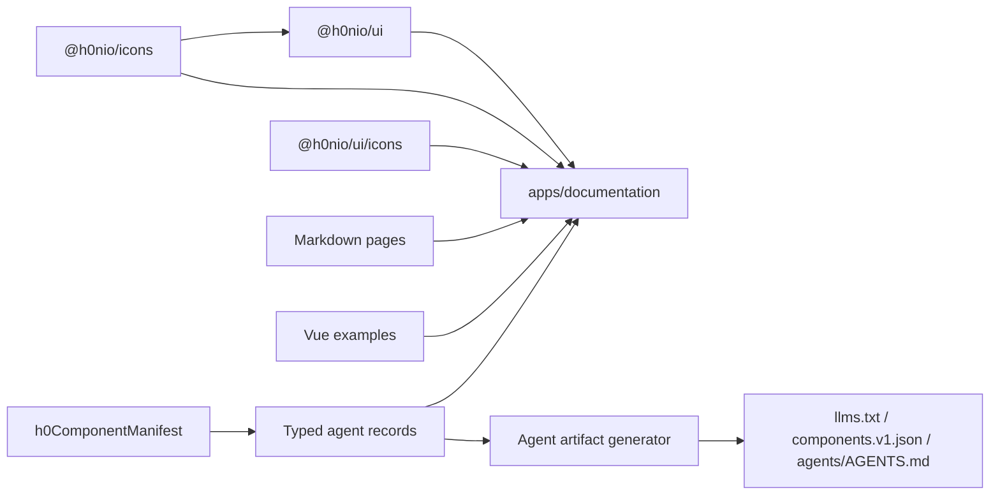

# H0N UI Architecture

Last verified: 2026-08-24

Current library version: `@h0nio/ui` `1.3.0`

H0N UI is a pnpm workspace centered on a self-contained Vue 3 component library, a framework-agnostic icon library, and a source-linked documentation application.

## Maintained Workspace

```text
h0n-ui/
  packages/
    icons/                      # @h0nio/icons: independently versioned icon package
      scripts/                  # Import, generation, validation, and SVG copy tools
      src/                      # Generated definitions, catalog, metadata, and runtime
      svg/                      # Generated package SVG subpaths
    ui/                         # @h0nio/ui: supported Vue component library
      contracts/                # Reviewed public API and CSS-token snapshot
      scripts/                  # Build fixtures, style typings, size verification
      test-consumer/            # Real bundler consumer fixtures
      test-dts/                 # Public TypeScript import fixtures
      tests/                    # Vitest behavior and contract gates
      tests-visual/             # Playwright visual/accessibility gates
      src/
        components/             # Component families and internal _shared helpers
        composables/            # Public Vue composables
        icons/                  # Compatibility facade for the former system aliases
        styles/                 # Tokens, palettes, theme, mixins, breakpoints
        entry.ts                # Full style-aware package entry
        index.ts                # Root API and Vue plugin
        locale.ts               # App-scoped locale service
        manifest.ts             # Supported component metadata
        theme.ts                # App-scoped appearance service
        types.ts                # Shared public contracts
  apps/
    documentation/              # @h0n/ui-documentation
      public/                   # Static assets and generated agent artifacts
      scripts/                  # Agent artifact generator and tests
      src/
        components/             # Documentation shell and renderers
        content/pages/          # Markdown content and routes
        content/agent/          # Typed records, validation, artifact rendering
        examples/               # Executable Vue examples
        router/                 # Catch-all content router
```

`apps/templates` is incubating and intentionally outside this architecture baseline.

## Runtime and Toolchain

- pnpm workspaces, pinned through `packageManager` to pnpm `11.17.0`
- Vue `3.5`
- TypeScript `5.9` with strict base configuration
- Vite `8`
- Sass/SCSS with CSS custom properties and cascade layers
- Vitest for unit and contract tests
- Playwright and axe-core for visual, interaction, and accessibility checks
- Vue Router and Markdown It in the documentation app
- Documentation scripts require Node `>=22.12.0`

Root scripts explicitly compose `@h0nio/icons`, `@h0nio/ui`, and `@h0n/ui-documentation`. Package filters remain useful for proportional checks.

## Package Relationships


```mermaid
flowchart LR
    UI["@h0nio/ui"] --> Docs["apps/documentation"]
    IconLibrary["@h0nio/icons"] --> UI
    IconLibrary --> Docs
    CompatibilityIcons["@h0nio/ui/icons"] --> Docs
    Markdown["Markdown pages"] --> Docs
    Examples["Vue examples"] --> Docs
    Records["Typed agent records"] --> Docs
    Manifest["h0ComponentManifest"] --> Records
    Records --> Generator["Agent artifact generator"]
    Generator --> Public["llms.txt / components.v1.json / agents/AGENTS.md"]
```

`@h0nio/ui` owns the legacy node-based `H0IconDefinition`, the icons-compatible `H0IconBodyDefinition`, their `H0IconSource` union, and the `H0Icon` renderer. UI declares `@h0nio/icons` as a runtime dependency and internal components import only individual icon subpaths. The public `@h0nio/ui/icons` entry is a tree-shakeable compatibility facade that preserves the former aliases and `data-icon` names; runtime components do not import through it.

`@h0nio/icons` is the framework-agnostic icon catalog and is versioned independently from `@h0nio/ui`. Its lightweight root exports rendering helpers and types; individual icon subpaths are the primary application API. `catalog` exposes metadata without definitions, raw SVG files live under `svg/*`, and the intentionally expensive `all` entry owns the complete eager registry. Applications importing icon definitions directly declare the package themselves instead of relying on UI's transitive dependency.

The documentation app aliases the icons package and both UI entries to workspace source and is therefore an integration surface, not a consumer of registry artifacts. A published `@h0nio/icons` release must be verified independently before a later `@h0nio/ui` release may declare it as a registry dependency.

## Library Entry and Plugin

`packages/ui/src/entry.ts` imports `styles/index.scss` and re-exports `src/index.ts`. It is the full bundle entry and the source alias used by documentation.

`packages/ui/src/index.ts`:

1. imports supported public components;
2. explicitly registers them through the default `H0Nui` Vue plugin;
3. creates and provides app-scoped theme, locale, and toast services;
4. exports supported components, composables, runtime helpers, and public types.

Plugin installation creates independent service instances for each Vue app. Theme and toast services dispose listeners and timers through `app.onUnmount`. Locale input can be either configuration for a new service or an existing service instance.

## Supported Components and Draft Placeholders

A supported root component has a synchronized family barrel, root API/registry entry, `h0ComponentManifest` entry, documentation page, and typed agent record. The manifest currently represents the documentation and agent contract; it is not generated by scanning directories.

`H0Dropdown` is a supported floating disclosure with one consumer-owned default
trigger and arbitrary `content`. It routes ARIA/events to that trigger, reuses the
floating-position and dismissable-layer helpers, and provides a non-modal dialog
with focus entry, Escape restoration, outside dismissal and Tab exit. It does not
provide semantic menuitems or lock scrolling. Size constraints yield to viewport
space; content styling remains owned by the consumer. Overlay keyboard handling
respects an event consumed by a nested disclosure/control.

`H0TextShimmer` is CSS-only feedback text with inherited typography and existing
palette tokens. It retains one accessible text representation, adds no automatic
live region, and animates only in effective High. Other profiles, reduced motion,
forced colors, and unsupported text clipping retain readable static text.

Orphaned compound members are not retained as public API. In particular, the former `Menu` members were removed because their only context provider was an unexported, unused surface; no application, documentation example, test, or other UI component consumed the family. Reintroducing a menu requires a complete root component, interaction model, documentation, and tests rather than restoring the detached members.

The workspace contains empty placeholder directories under `packages/ui/src/components` and draft example directories under documentation for names not yet supported by the library. They have no current Vue/type/barrel implementation in `packages/ui`, and they are absent from the root API, plugin registry, manifest, pages, and typed records. At the time of this audit these names include:

- `ActionBar`, `Calendar`, `Combobox`, `CursorPagination`, `DatePicker`
- `Disclosure`, `KeyValueList`, `PageHeader`, `Popover`, `Progress`
- `Section`, `Slider`, `Stat`, `Timeline`, `Tree`, `TreeSelect`

`InputGroup` is also an empty placeholder outside the supported root API.

There is an important packaging caveat: `vite.config.ts` automatically creates ES entries for every component directory that contains `index.ts`. The current placeholders have no `index.ts` and do not produce build output, but adding a barrel would make a draft family addressable as `@h0nio/ui/components/<Family>` before the other supported surfaces are synchronized. Treat root API + manifest + documentation + records as the support boundary until entry generation is intentionally restricted or incubation is formalized.

## Component and Type Conventions

Typical family:

```text
packages/ui/src/components/Button/
  H0Button.vue
  Button.types.ts
  index.ts
```

- Vue components use `<script setup lang="ts">` and `defineOptions({ name: 'H0...' })`.
- A family may expose several components, as with `Alert`, `Layout`, `SideNav`, `Tabs`, `Toast`, `Toolbar`, and `Typography`.
- Public component contracts live in `*.types.ts`; internal implementation types remain private.
- Shared public types use the `H0<Concept>` form only when semantics are identical across consumers.
- Reusable implementation behavior belongs in the family, `composables`, or `components/_shared` according to whether it is public and cross-family.
- `_shared` is private and may change without a public deprecation.

Controlled components use `modelValue !== undefined` as the controlled boundary and `defaultValue` for uncontrolled initialization. `update:*` events synchronize models; user interaction events expose normalized public values. Direct user-facing text props take precedence over locale fallbacks.

## Theme, Locale, and Toast Services

`theme.ts` owns reactive app-scoped appearance state:

- theme preference: `light`, `dark`, or `system`;
- resolved theme: `light` or `dark`;
- accent palette: `default`, `telegram`, or `uber`, independently of theme;
- animation preference: `off`, `low`, `medium`, `high`, or `recommended` (default `low`);
- resolved and recommended animation quality, evaluation state, and coarse recommendation reason;
- density: `compact`, `default`, or `comfortable`;
- radius size: `sm`, `md`, or `lg`;
- typography size: `sm`, `md`, or `lg`;
- optional theme persistence and a custom target element.

The service writes:

- `data-h0n-theme`
- `data-h0n-accent`
- `data-h0n-animation`
- `data-h0n-animation-preference`
- `data-h0n-density`
- `data-h0n-radius-size`
- `data-h0n-typography-size`

Browser globals are guarded for SSR. System-theme listeners are attached only when supported and are removed by `dispose()`.

Accent presets pair a light and dark foundation palette in `_palettes.scss`.
`_theme.scss` applies them to the same target as the resolved theme, retaining the
stable semantic token names and Default values. Primary foreground is palette-aware;
fixed-color avatar gradients and status fills keep independent foregrounds. When
`storageKey` is enabled, accent is saved under `<storageKey>:accent`, separate from
the existing theme preference. Storage failure falls back to in-memory appearance.

`useH0Animation()` exposes the same app-scoped policy used by library CSS and JS.
`data-h0n-animation` contains effective quality; the preference attribute retains
the requested mode. System reduced motion always resolves to Off, even for manual
High. Off suppresses library transitions/keyframes and carousel autoplay. Low keeps
short color/opacity feedback; Medium adds standard motion and simple rotations;
High adds ripple, shimmer and rich overlays. `useH0ReducedMotion()` returns true
for effective Off or Low. Static status and control semantics remain available.

The private `_animation.ts` controller evaluates Recommended after mount with
coarse resource/Save-Data hints, a released temporary graphics context, and a
bounded foreground rAF sample. Unknown graphics caps at Medium; unavailable or
software/caveat graphics selects Low. It starts at Low for SSR/initial render,
pauses hidden tabs, refreshes on return and relevant preference changes, and offers
explicit re-evaluation. No permanent frame monitor, device data persistence, or
renderer-string exposure is used. This is a heuristic for UI motion, not a GPU or
hardware-performance guarantee. Plugin unmount and standalone `dispose()` cancel
sampling and remove listeners. CSS includes an independent system-preference
fallback and Off overrides for component-local custom animation durations.

`locale.ts` provides reactive built-in English strings plus partial application overrides. Components obtain their relevant branch through shared locale helpers. Runtime-value messages are functions.

Toast state is created per plugin installation. It is not a process-global singleton.

## Styling Contract

The global style system is token-driven:

- `styles/index.scss`: layer order, shared scales, appearance attributes, and global compatibility variables;
- `styles/_palettes.scss`: light/dark raw palettes and semantic values;
- `styles/_theme.scss`: theme application and compatibility aliases;
- `styles/_breakpoints.scss`: shared breakpoint values;
- `styles/_mixins.scss`: reusable SCSS implementation helpers;
- component-local scoped styles: family behavior and private aliases.

Stable application-overridable custom-property families use the `--h0n-ui-*` prefix:

- color and semantic surface tokens;
- spacing and radius scales;
- duration and easing;
- font and typography;
- shared control, overlay, scrollbar, table, and layer geometry.

Component-local variables without that prefix are private. The reviewed stable-token set is frozen in `packages/ui/contracts/public-contract.snapshot.json`.

## Packaging

`packages/ui/vite.config.ts` performs two builds:

- UMD build from `src/entry.ts`;
- multi-entry ES build for the full entry, `locale`, `theme`, `manifest`, composables, and discovered component families.

External runtime dependencies are Vue, Floating UI, and individual `@h0nio/icons/*` modules for ES consumers. The UMD build bundles only definitions reached by UI's internal controls so the global build remains autonomous. Type declarations are emitted separately by `vue-tsc`.

The build has two nonstandard but required CSS behaviors:

1. `injectCssIntoEsBundle()` prepends the full CSS import to the ES root bundle.
2. `emitComponentStyleEntries()` emits dependency-complete component CSS entries using ordered `h0n.tokens`, `h0n.base`, and `h0n.components` layers.

Package exports support:

- `@h0nio/ui`
- `@h0nio/ui/style.css`
- `@h0nio/ui/components/<Family>`
- `@h0nio/ui/components/<Family>/style.css`
- `@h0nio/ui/icons`
- root and individual composables
- `locale`, `theme`, and `manifest`

`packages/ui/package.json` is the npm publication manifest. It identifies the public MIT-licensed package, limits published files to `dist`, `README.md`, `LICENSE`, and `LICENSE-THIRD-PARTY`, marks CSS as side-effectful, and keeps repository, issue, style, type, ESM, UMD, and subpath metadata explicit. The package remains public and must not acquire a `private` flag. The workspace dependency `@h0nio/icons: workspace:^` is published as a compatible registry range.

`scripts/write-style-types.mjs` creates CSS declaration stubs. Consumer fixtures verify real imports and tree-shaking; size checks enforce bundle budgets. `scripts/verify-package-contents.mjs` performs a dry-run pack and rejects missing export targets, unexpected top-level files, private source/test files, and source maps. `prepublishOnly` runs tests and the complete build before registry publication.

Repository-level contribution, security, and release policies live in `CONTRIBUTING.md`, `SECURITY.md`, and `RELEASING.md`. GitHub issue and pull-request templates route public reports through those policies. Registry publication remains a maintainer action until npm trusted publishing is explicitly configured; the quality workflow does not publish packages.

The `@h0nio/ui/icons` ES entry re-exports individual `@h0nio/icons` definitions under the former aliases. It must remain tree-shakeable and must never import `@h0nio/icons/all` or the catalog.

## Independent Versioning and Releases

`@h0nio/ui` and `@h0nio/icons` follow semantic versioning independently. A change to documentation, workspace orchestration, or one package does not automatically change the version of the other package.

Package-specific Git tags and GitHub Releases prevent the two histories from colliding:

- `ui-v<version>` for `@h0nio/ui`;
- `icons-v<version>` for `@h0nio/icons`.

Every registry release is built from a reviewed commit, verified through its package-specific checks and installed-tarball fixture, and published manually according to `RELEASING.md`. The icons package must be published and its public subpaths verified before an `@h0nio/ui` release may add or update a registry dependency on it.

## Documentation Architecture

The experimental `/editor` route is a separate lazy view for local component
composition. It has exactly two editable files, `App.vue` and `style.css`, with
automatic inclusion of the CSS file. Version 2 drafts/imports enforce this shape;
earlier drafts remain separately exportable. Vue SFC compilation and TypeScript
transpilation run in the browser, with the preview compiler loaded only on Run.

CodeMirror provides Vue/TS/CSS highlighting, completion and mapped error markers.
A dedicated browser worker runs Vue language-core and the TypeScript language
service against Vue virtual code. It verifies scripts, template expressions and
component props without executing user code. Completion metadata for component
tags, props and literal values comes from the typed documentation records.
`scripts/editor-types-plugin.ts` emits current UI source declarations into an
ignored cache and packages their dependency closure, Vue template helpers and TS
standard libraries into a local asset. Virtual module mappings use portable paths;
no type declarations are fetched from a CDN. Editor-only global types mirror the
plugin's registered components and native event forwarding. Language-tool requests
use revisions to discard stale diagnostics; leaving the page terminates the worker.

`scripts/editor-runtime-plugin.ts` bundles the current workspace Vue/UI and the
compatibility icon facade into a self-contained preview runtime. The editor loads
these same-origin assets and embeds them into an opaque-origin sandbox iframe with
network-denying CSP. Each run creates a new document and app-scoped services;
messages require the frame source and a per-run token. Only `vue`, `@h0nio/ui`,
`@h0nio/ui/icons` and the optional `./style.css` import are supported. The runtime bundle is
separate from the library publication and does not change its public API.

The prototype uses explicit Run, JSON import/export and local storage. It has no
backend, external package loader or visual drag-and-drop builder. Saved/imported
code is not automatically executed. An iframe cannot guarantee CPU isolation from
infinite-loop code; production adoption needs further execution-budget and hosting
CSP review. Editor-specific compiler, language-service and browser checks run with the documentation
package's `test:editor` script.

Documentation pages are Markdown-first. Frontmatter supplies title, description, route path, navigation group/section, and order. `content.ts` discovers pages with `import.meta.glob`, validates them, and renders navigation, search, tables, alerts, examples, and component API directives.

Executable examples live under `src/examples`; Markdown references them by key. The application renders the same Vue source as a live responsive preview and as copyable code.

Component API tables are derived from `ComponentAgentRecordV1` records. Validation enforces:

- one record per supported manifest component;
- exactly one family root per documentation route;
- valid page paths and example keys;
- unique API entries and related components;
- no references to components outside the manifest.

The generator combines records, manifest metadata, pages, examples, and the `@h0nio/ui` package version to produce:

- `public/llms.txt`
- `public/agent-data/components.v1.json`
- `public/agents/AGENTS.md`
- `public/agents/install-prompt.md`

The resources have distinct roles:

- `llms.txt` is the versioned discovery and routing layer. It describes package boundaries, the recommended agent workflow, and every supported component grouped by manifest category.
- `components.v1.json` is the exact machine-readable component contract and guidance layer.
- `agents/AGENTS.md` is a reusable policy template for repositories consuming `@h0nio/ui`.
- `agents/install-prompt.md` is a versioned copy-paste workflow for installing, configuring, and validating H0N UI in an existing Vue project.

Consumer agents resolve leading-slash links against the H0N UI documentation origin, not the consuming application. They treat the installed package version and TypeScript declarations as the executable contract, then use the matching catalog, compact index, and human documentation in that order. These files are derived artifacts and deterministic tests reject stale committed output. MCP server and distributable Agent Skills remain planned and are not part of the current runtime.

## Verification Layers

The core library uses complementary gates:

- `typecheck`: source declarations and consumer-facing DTS imports;
- Vitest behavior tests for components, forms, overlays, SSR isolation, and interactions;
- public API and manifest synchronization tests;
- source-level accessibility and token rules;
- reviewed hashes for root exports, component contracts, and stable CSS variables;
- consumer bundler fixtures for root/subpath JS and CSS;
- bundle-size budgets;
- Playwright visual geometry, screenshots, navigation, forced-colors, and axe checks.

`packages/ui/tsconfig.check.json` checks UI source without requiring another workspace build. `packages/ui/tsconfig.json` remains the declaration-build configuration rooted at UI source.

`tests`, `test-dts`, `test-consumer`, and `tests-visual` are maintained test sources with distinct responsibilities. `test-consumer/dist` and `test-results` are ignored, generated outputs and must not be committed or treated as source directories. Axe runs against executable component previews; color contrast requires a dedicated theme/state matrix and is intentionally outside the structural axe gate.

Documentation verifies TypeScript, generated agent artifacts, generator determinism/schema behavior, and a production Vite build.

At the 2026-07-28 test audit, the reviewed component-contract snapshot was restricted to supported manifest families and excludes private `_shared` implementation files. Files are ordered by repository-relative POSIX paths so the contract is identical on Windows and Linux. The snapshot also freezes the shared public types in `src/types.ts`. Its accepted 1.0 component hash is `b36d0c8a9eaae1a6dcd3ab18134b8088340ed96072fb1bc6c54af01b928e2315`. The DataTable consumer fixture is `16.00 KiB` gzip against a reviewed `18 KiB` budget; all current bundle and component-style budgets pass.

## Stable 1.0 Policy

The supported contract consists of documented root and subpath exports, props, events, slots, exposed methods, public types, and stable CSS variables.

- Patch releases fix behavior without intentional signature changes.
- Minor releases add compatible API and may deprecate existing API.
- Breaking supported API changes require a major release and an explicit migration guide.
- Accessibility fixes may adjust undocumented markup while preserving documented semantics.
- Internal modules, private custom properties, and undocumented DOM structure are not semver guarantees.

An intentional contract change must update implementation, exports, manifest, documentation, typed records, consumer fixtures, and the reviewed contract snapshot as applicable.

## High-Impact Change Map

- `src/index.ts`: root imports, plugin registration, declarations, contract hash.
- `src/manifest.ts`: documentation routing, agent validation, public manifest tests.
- `src/theme.ts` / `src/locale.ts`: all app instances, SSR, and plugin lifecycle.
- `src/styles`: every component and the stable CSS-variable snapshot.
- `vite.config.ts` / `package.json`: registry imports, CSS distribution, tree-shaking, consumer fixtures.
- component `*.types.ts` or `.vue` public contracts: contract hash, docs API records, and downstream types.
- documentation records/examples/pages: runtime documentation and generated agent artifacts.
